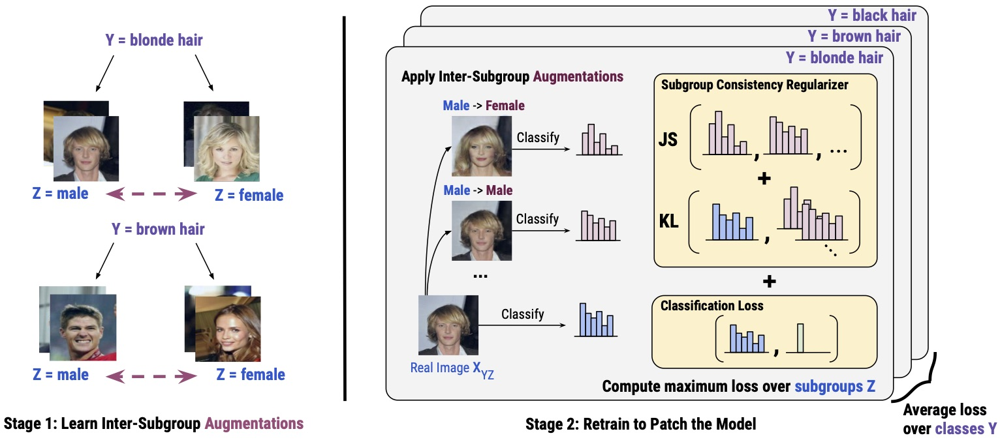
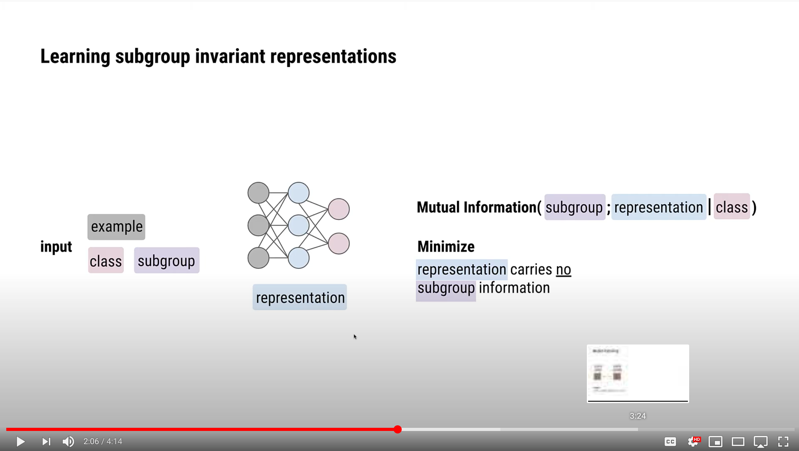

# Model Patching: Closing the Subgroup Performance Gap with Data Augmentation

> **Model Patching: Closing the Subgroup Performance Gap with Data Augmentation**\
> Karan Goel*, Albert Gu*, Yixuan Li, Christopher Ré\
> Stanford University\
> Paper: https://arxiv.org/pdf/2008.06775.pdf \
> Blog: http://hazyresearch.stanford.edu/data-aug-part-4


> **Abstract.** Classifiers in machine learning are often brittle when deployed. 
Particularly concerning are models with inconsistent performance on specific _subgroups_ of a class, 
e.g., exhibiting disparities in skin cancer classification in the presence or absence of a spurious bandage.
To mitigate these performance differences, 
we introduce _model patching_, 
a two-stage framework for improving robustness that encourages the model to be invariant to subgroup differences, and focus on class information shared by subgroups.
Model patching
first models subgroup features within a class and learns semantic transformations between them,
and then trains a classifier with data augmentations that deliberately manipulate subgroup features.
We instantiate model patching with CAMEL, which (1) uses a CycleGAN to learn the intra-class, inter-subgroup augmentations, and (2) balances subgroup performance using a theoretically-motivated subgroup consistency regularizer, accompanied by a new robust objective.
We demonstrate CAMEL's effectiveness on 3 benchmark datasets, with reductions in robust error of up to 33\% relative to the best baseline. Lastly, CAMEL successfully patches a model that fails due to spurious features on a real-world skin cancer dataset. 


## 4-Minute Explanation Video
Click the figure to watch this short video explaining our work.

[](https://www.youtube.com/watch?v=IqRh-SVNl-c)

## Setup

Create a Python environment and install dependencies. All our models and training are implemented in Tensorflow 2.0, and we use Weights and Biases for logging. You'll need to create a Weights and Biases account to run our code.
```bash
# Clone the repository
git clone https://github.com/HazyResearch/model-patching.git
cd model-patching/

# Create a Conda environment
conda create -n model_patching python=3.6
conda activate model_patching

# Install dependencies
pip install -r requirements.txt
```


Download datasets from our Google Cloud Bucket and unzip,
```bash
# Download CelebA: ~1.6 GiB
wget https://storage.googleapis.com/model-patching/celeba_tfrecord_128.zip
# Download Waterbirds: ~0.4 GiB
wget https://storage.googleapis.com/model-patching/waterbirds_tfrecord_224.zip
```

For convenience, we include a release of the MNIST-Correlation dataset (see paper for details) that we created. This is intended for use in your research, and is not required to re-run our experiments on MNIST-Correlation.
```bash
wget https://storage.googleapis.com/model-patching/mnist_correlation_npy.zip
```


## Stage 1: Learning Augmentations with a Subgroup Transformation Model

For Stage 1 with CycleGAN Augmented Model Patching (CAMEL), we include configs for training CycleGAN models. Typically, we train one model per class, where the model learns transformations between the subgroups of the class. This is not necessary, and you could alternatively train e.g. a single StarGAN model for all classes and subgroups in your setting.  

#### Training from Scratch
It is not necessary to train these models to reproduce our results, and you can just reuse the augmented datasets that we provide if you want to skip this step.
```bash
# Training a single CycleGAN model for MNIST-Correlation
python -m augmentation.methods.cyclegan.train --config augmentation/configs/stage-1/mnist-correlation/config.yaml

# Training CycleGAN models on Waterbirds
python -m augmentation.methods.cyclegan.train --config augmentation/configs/stage-1/waterbirds/config-1.yaml
python -m augmentation.methods.cyclegan.train --config augmentation/configs/stage-1/waterbirds/config-2.yaml

# Training CycleGAN models on CelebA-Undersampled
python -m augmentation.methods.cyclegan.train --config augmentation/configs/stage-1/celeba/config-1.yaml
python -m augmentation.methods.cyclegan.train --config augmentation/configs/stage-1/celeba/config-2.yaml
```

All of these configs are supplied to the `augmentations/methods/cyclegan/train.py` file. You can find a template configuration file to run your own CycleGAN training experiments at `augmentation/configs/template_cyclegan_training.yaml`.

#### Reusing our CycleGANs
We provide `.tfrecord` datasets that can be used to replicate the outputs of Stage 1,
```bash
# Downloads logs for Stage-1: ~38 GiB
wget https://storage.googleapis.com/model-patching/stage-1-tfrecords.zip
```

We include links to the logs for the CycleGAN models on Weights and Biases for the models we used in the paper,
```bash
# CycleGAN model for MNIST-Correlation
https://app.wandb.ai/hazy-research/mnist-correlation/runs/hfyg9z4t

# CycleGAN model for Waterbirds
https://app.wandb.ai/hazy-research/waterbirds/runs/vla2y0m7
https://app.wandb.ai/hazy-research/waterbirds/runs/5f2gmy7w

# CycleGAN model for CelebA-Undersampled
https://app.wandb.ai/hazy-research/celeba/runs/xbqhzkx3
https://app.wandb.ai/hazy-research/celeba/runs/xs4l2gi0
```


## Stage 2: Training a Robust End-Model

For Stage 2, we include configs for training classifiers with consistency regularization and Group DRO [Sagawa et al., ICLR 2020], as well as standard ERM training. 

```bash
# Training {CAMEL, Group DRO, ERM} on {MNIST-Correlation, Waterbirds, CelebA-Undersampled}
python -m augmentation.methods.robust.train --config augmentation/configs/stage-2/{mnist-correlation,waterbirds,celeba}/{camel,gdro,erm}/config.yaml
```

These configs are supplied to the `augmentations/methods/robust/train.py` file. You can find a template configuration file to run end-model training experiments at `augmentation/configs/template_robust_training.yaml`.

We include an implementation of the Group DRO trainer as well as various consistency penalties at `augmentation/methods/robust/utils.py`. They should be easy to port over to your own codebase.

## Citation
If you use our codebase, or otherwise found our work valuable, please cite us
```
@article{goelmodelpatching,
  title={Model Patching: Closing the Subgroup Performance Gap with Data Augmentation},
  author={Karan Goel and Albert Gu and Yixuan Li and Christopher Re},
  journal={arXiv preprint arXiv:2008.06775},
  year={2020}
}
```

## Questions and Feedback
For feedback on our work, and any specific questions, feel free to reach out at `kgoel [at] cs [dot] stanford [dot] edu`.


## About
The emoji for model patching on the Hazy Research website was designed by OpenMoji – the open-source emoji and icon project. License: CC BY-SA 4.0
